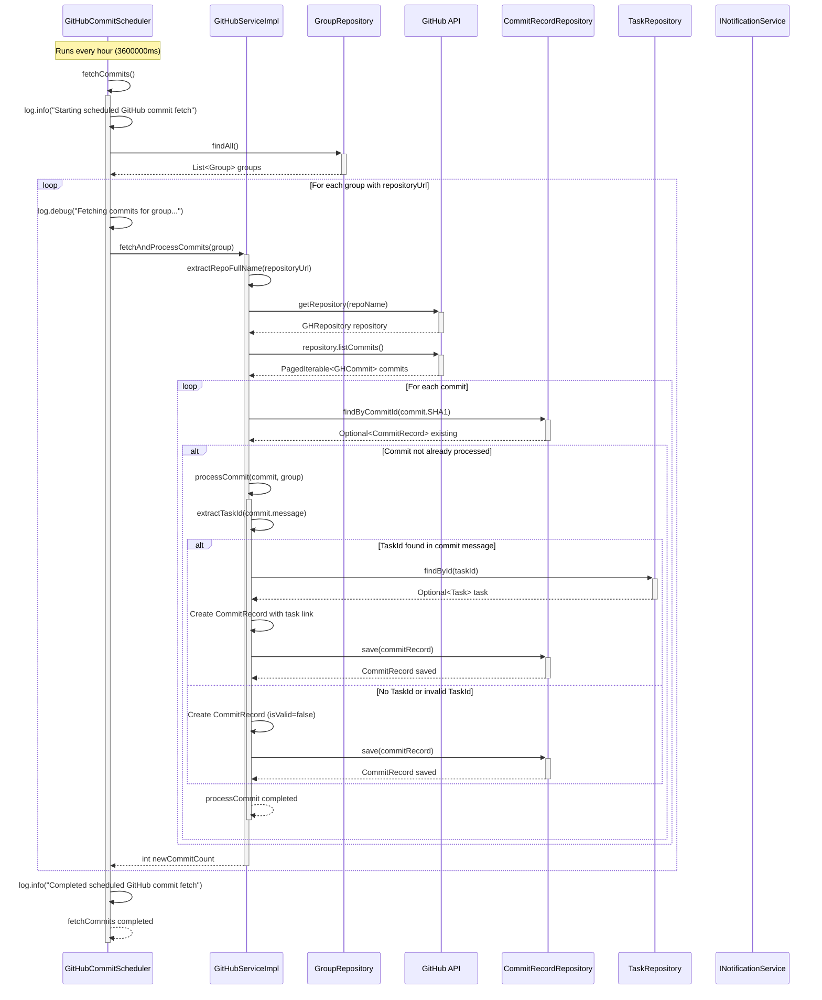
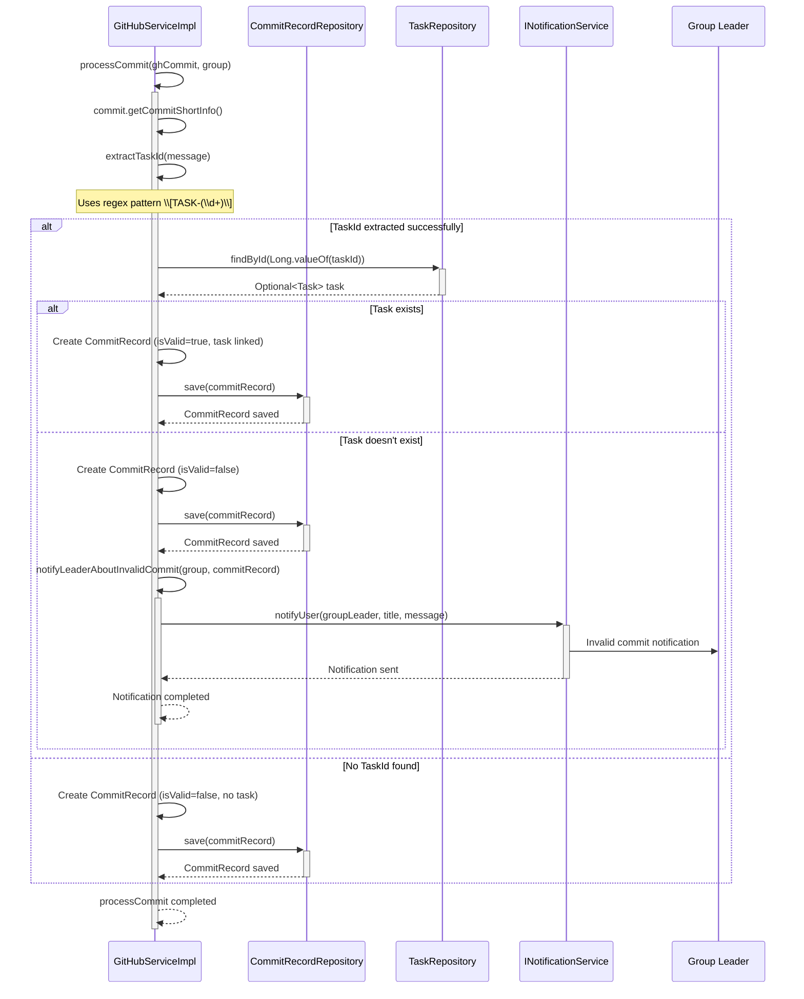
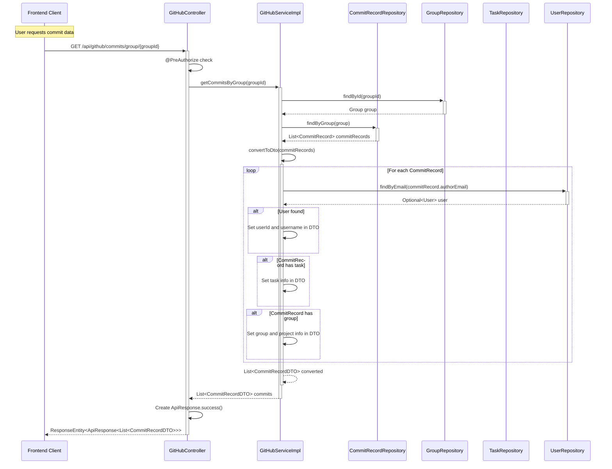

# UC006: GitHub Integration and Task History Tracking - Sequence Diagrams

Based on the actual implementation analysis, here are the sequence diagrams for the GitHub integration feature that automatically fetches commits and tracks task progress.

## Scenario 1: Scheduled Commit Fetching (Happy Path)



## Scenario 2: Commit Processing with Task Validation



## Scenario 3: REST API Commit Retrieval



## Scenario 4: Error Handling in Commit Fetching

```mermaid
sequenceDiagram
    participant Scheduler as GitHubCommitScheduler
    participant GitHubService as GitHubServiceImpl
    participant GitHub as GitHub API
    participant Logger as Logging System

    Scheduler->>+GitHubService: fetchAndProcessCommits(group)
    
    alt Repository URL is null or empty
        GitHubService->>+Logger: log.warn("Group has no GitHub repository URL")
        Logger-->>-GitHubService: Warning logged
        GitHubService-->>-Scheduler: return 0
    else Invalid repository URL format
        GitHubService->>GitHubService: extractRepoFullName(repositoryUrl)
        GitHubService->>+Logger: log.error("Invalid GitHub repository URL")
        Logger-->>-GitHubService: Error logged
        GitHubService-->>-Scheduler: return 0
    else GitHub API access error
        GitHubService->>+GitHub: getRepository(repoName)
        GitHub-->>-GitHubService: IOException thrown
        
        GitHubService->>+Logger: log.error("Error accessing GitHub repository")
        Logger-->>-GitHubService: Error logged
        GitHubService-->>-Scheduler: return 0
    end
    
    Note over Scheduler: Scheduler continues with next group despite errors
```

## Key Implementation Details

### TASK-ID Pattern
- **Regex Pattern**: `\\[TASK-(\\d+)\\]`
- **Example**: `[TASK-123]` extracts task ID `123`
- **Location**: Used in `GitHubServiceImpl.extractTaskId()` method

### Scheduling Configuration
- **Frequency**: Every hour (3600000ms by default)
- **Configuration**: `@Scheduled(fixedDelayString = "${github.commit.fetch-interval:3600000}")`
- **Runs on**: All groups with configured repository URLs

### Database Entities
- **CommitRecord**: Stores commit information with task linkage
- **Task**: Links commits to specific tasks
- **Group**: Contains repository URL configuration
- **Project**: Groups commits by project for reporting

### Validation Rules
1. Commit must contain valid `[TASK-ID]` format
2. Task ID must exist in database
3. Task must belong to the same project as the group
4. Duplicate commits (same SHA1) are skipped

### Notification System
- Group leaders are notified when invalid commits are detected
- Notifications include commit details and invalid task ID
- Only sent for commits with task ID format but non-existent task

This implementation provides automated tracking of development progress through GitHub commits while maintaining data integrity and providing proper error handling and notifications.
