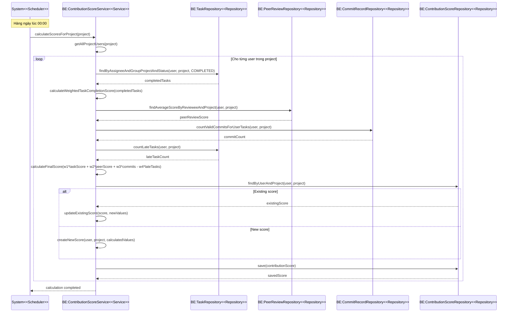
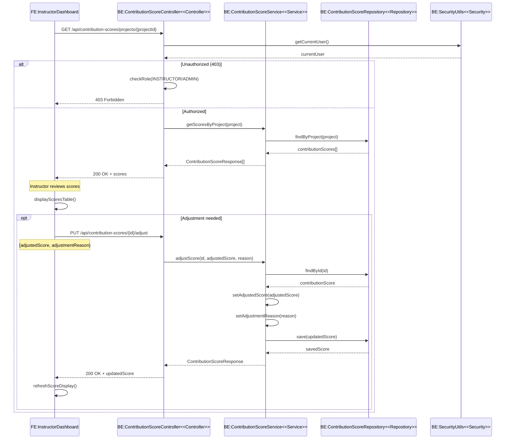
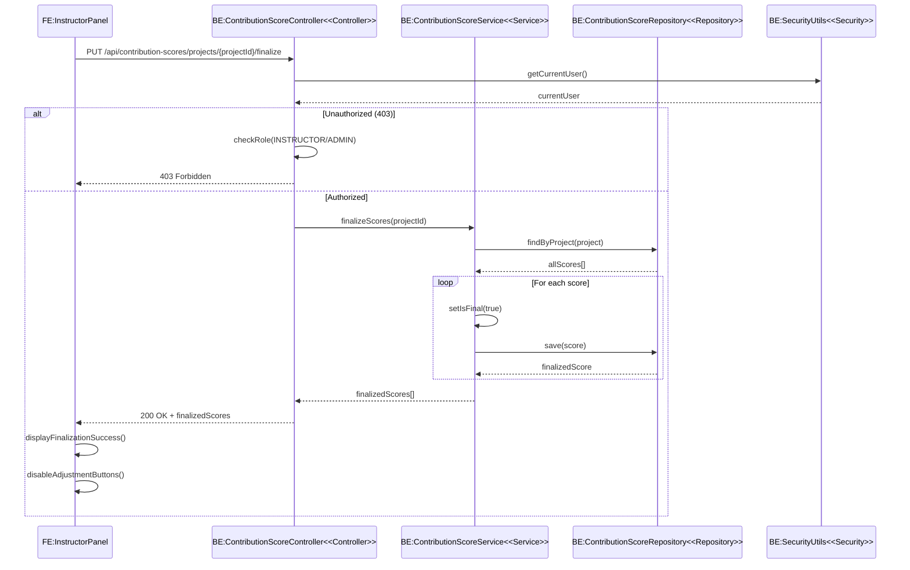
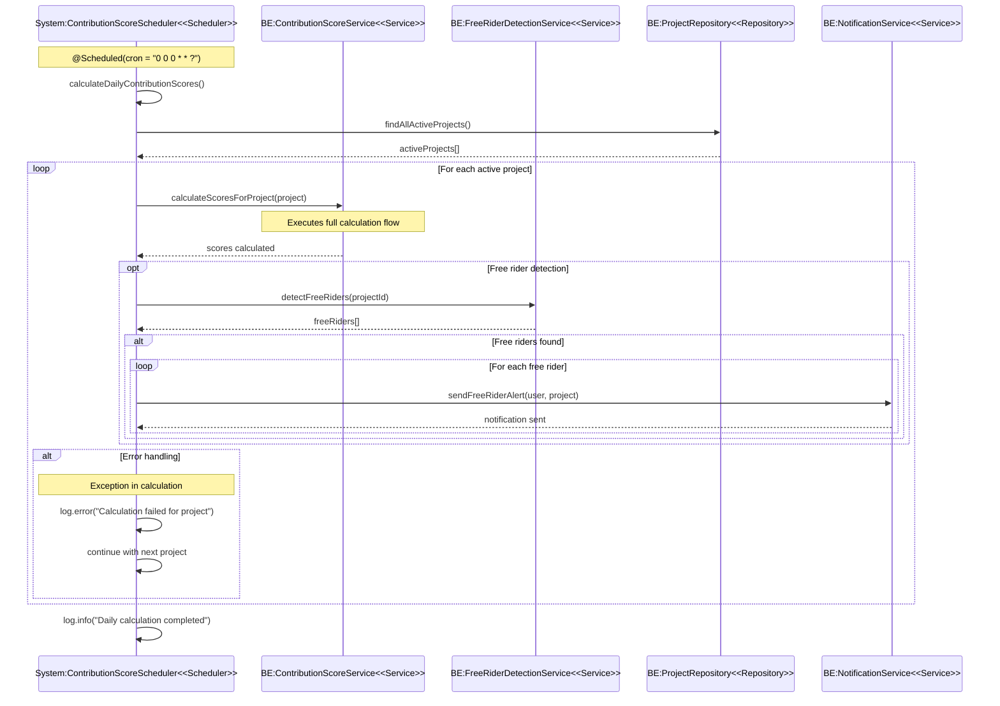

# UC007 - Đánh giá mức độ đóng góp (Contribution Score Evaluation)

## Đặc tả Use Case

| Thuộc tính | Chi tiết |
|------------|----------|
| **Mã Use case** | UC007 |
| **Tên Use case** | Đánh giá mức độ đóng góp |
| **Tác nhân** | Hệ thống, Người hướng dẫn |
| **Mô tả ngắn** | Hệ thống tự động tính toán điểm đóng góp của thành viên dựa trên công thức kết hợp nhiều yếu tố |
| **Tiền điều kiện** | Có dữ liệu từ UC004 (Task Management), UC005 (Peer Review), UC006 (GitHub Integration), UC008 (Late Task Detection) |
| **Hậu điều kiện** | • Điểm đóng góp được xác định và lưu trữ<br>• Người hướng dẫn có thể xem và điều chỉnh điểm |

### Luồng sự kiện chính (Thành công)

| STT | Thực hiện bởi | Hành động |
|-----|---------------|-----------|
| 1 | Hệ thống | Tính WeightedTaskCompletionScore dựa trên độ khó các task đã hoàn thành |
| 2 | Hệ thống | Tính điểm đóng góp theo công thức: `(W1 * WeightedTaskCompletionScore) + (W2 * PeerReviewScore) + (W3 * CommitCount) - (W4 * LateTaskCount)` |
| 3 | Người hướng dẫn | Xem và điều chỉnh điểm nếu cần thiết |
| 4 | Hệ thống | Lưu điểm cuối cùng và đánh dấu là final |

## Implementation Analysis

### Core Components

1. **ContributionScoreServiceImpl** - Logic tính toán điểm chính
2. **ContributionScoreController** - REST API endpoints
3. **ContributionScoreScheduler** - Tự động tính toán hàng ngày
4. **ContributionScore Entity** - Model dữ liệu điểm đóng góp

### Calculation Formula

```
ContributionScore = (W1 * WeightedTaskCompletionScore) + 
                   (W2 * PeerReviewScore) + 
                   (W3 * CommitCount) - 
                   (W4 * LateTaskCount)
```

**Thành phần tính toán:**
- **WeightedTaskCompletionScore**: Điểm hoàn thành task có trọng số theo độ khó
- **PeerReviewScore**: Điểm trung bình từ peer review
- **CommitCount**: Số commit hợp lệ (theo convention [TASK-ID])
- **LateTaskCount**: Số task nộp muộn + task quá hạn chưa hoàn thành

## Sequence Diagrams

### SD-01 — Happy Path: Tính toán điểm đóng góp tự động



### SD-02 — Instructor View và Adjustment: Người hướng dẫn xem và điều chỉnh điểm



### SD-03 — Score Finalization: Hoàn tất điểm cuối cùng



### SD-04 — Scheduled Auto-Calculation: Tính toán tự động theo lịch



## Key Features

### 1. Automated Daily Calculation
- Chạy tự động lúc 00:00 hàng ngày
- Tính toán cho tất cả projects đang hoạt động
- Tích hợp với free rider detection

### 2. Multi-factor Scoring
- **Task Completion**: Điểm hoàn thành task có trọng số
- **Peer Reviews**: Điểm đánh giá từ đồng nghiệp
- **Commit Activity**: Hoạt động commit trên GitHub
- **Late Penalty**: Trừ điểm cho task nộp muộn

### 3. Instructor Management
- Xem tổng quan điểm đóng góp của team
- Điều chỉnh điểm với lý do cụ thể
- Hoàn tất điểm cuối cùng (finalize)

### 4. Score History & Tracking
- Lưu trữ lịch sử thay đổi điểm
- Theo dõi điều chỉnh của instructor
- Đánh dấu điểm đã được finalize

## Error Handling

### Authentication & Authorization
- Kiểm tra quyền INSTRUCTOR/ADMIN cho các thao tác điều chỉnh
- Trả về 403 Forbidden nếu không có quyền

### Data Validation
- Kiểm tra tồn tại của project và user
- Validate điểm điều chỉnh trong phạm vi hợp lệ
- Đảm bảo dữ liệu tính toán đầy đủ

### Calculation Resilience
- Xử lý exception trong quá trình tính toán
- Tiếp tục với project khác nếu có lỗi
- Logging chi tiết cho debugging

## Technology Stack

- **Backend**: Spring Boot, Spring Security, JPA/Hibernate
- **Database**: MySQL với các repositories
- **Scheduling**: Spring @Scheduled annotations
- **Frontend**: React/TypeScript với contribution score service
- **Security**: JWT-based authentication
