# Sequence Diagrams for UC009 & UC010

## UC009 - Theo dõi biểu đồ hiệu suất làm việc (Performance Chart Monitoring)

### Scenario 1: View Commit Count Chart (Happy Path)

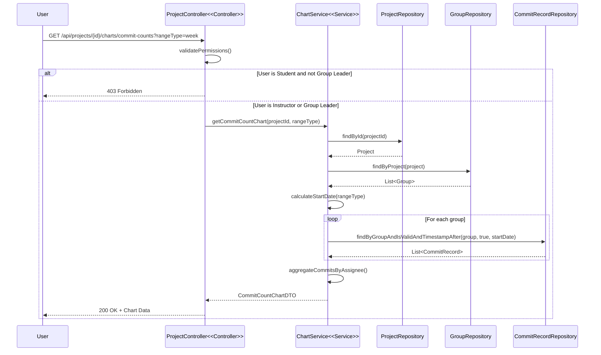

### Scenario 2: View Progress Timeline Chart (Happy Path)

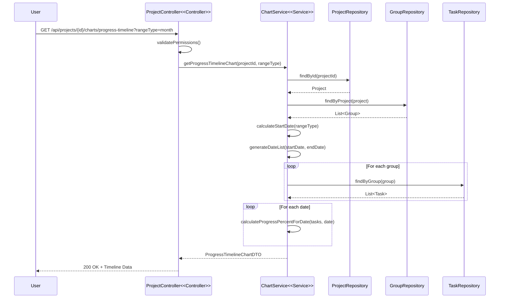

### Scenario 3: View Contribution Pie Chart (Happy Path)

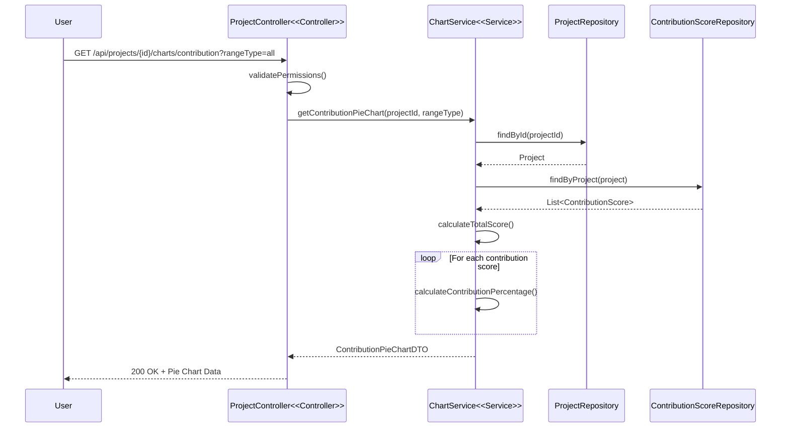

### Scenario 4: Permission Denied (Exception Flow)

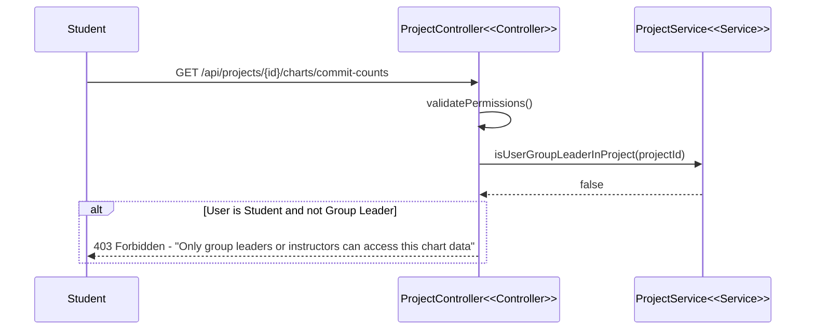

### Scenario 5: Project Not Found (Exception Flow)

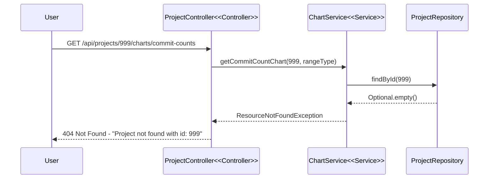

---

## UC010 - Phát hiện thành viên "tự do" (Free-rider Detection)

### Scenario 1: Manual Free-rider Detection without Notifications (Happy Path)

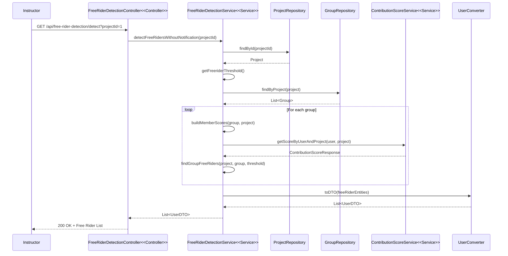

### Scenario 2: Automated Detection with Notifications (Batch Process)

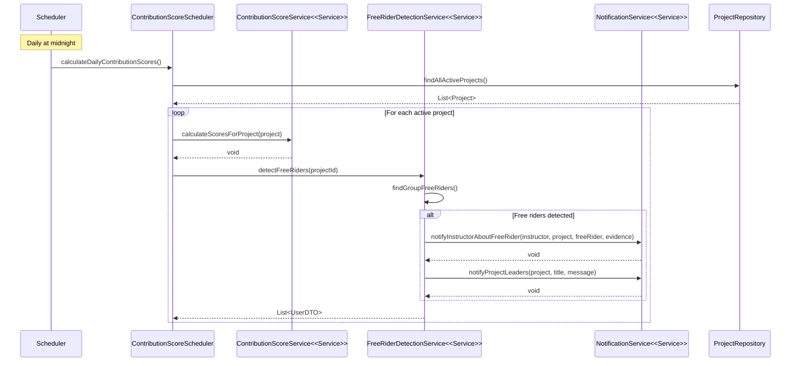

### Scenario 3: View Free-rider Evidence (Happy Path)

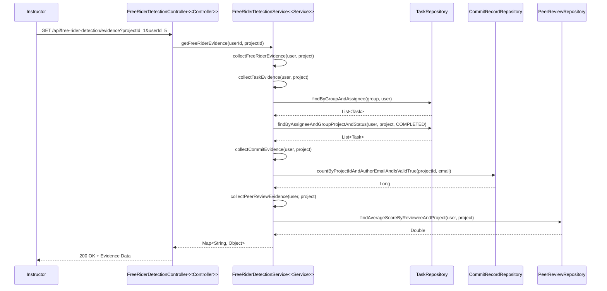

### Scenario 4: Create Free-rider Case (Happy Path)

```mermaid
sequenceDiagram
    participant I as Instructor
    participant FRC as FreeRiderDetectionController<<Controller>>
    participant FRS as FreeRiderDetectionService<<Service>>
    participant UR as UserRepository
    parameter PR as ProjectRepository
    participant GR as GroupRepository
    participant FCR as FreeRiderCaseRepository
    participant OM as ObjectMapper
    participant FCC as FreeRiderCaseConverter

    I->>FRC: POST /api/free-rider-detection/create-case?projectId=1&userId=5
    FRC->>FRS: createFreeRiderCase(userId, projectId)
    FRS->>UR: findById(userId)
    UR-->>FRS: User
    FRS->>PR: findById(projectId)
    PR-->>FRS: Project
    FRS->>FCR: existsActiveCase(projectId, userId)
    FCR-->>FRS: false
    FRS->>GR: findByProjectAndMembersContains(project, student)
    GR-->>FRS: Group
    FRS->>FRS: getFreeRiderEvidence(userId, projectId)
    FRS->>OM: writeValueAsString(evidence)
    OM-->>FRS: String
    FRS->>FCR: save(freeRiderCase)
    FCR-->>FRS: FreeRiderCase
    FRS->>FCC: toDTO(savedCase)
    FCC-->>FRS: FreeRiderCaseDTO
    FRS-->>FRC: FreeRiderCaseDTO
    FRC-->>I: 200 OK + Case Created
```

### Scenario 5: Resolve Free-rider Case (Happy Path)

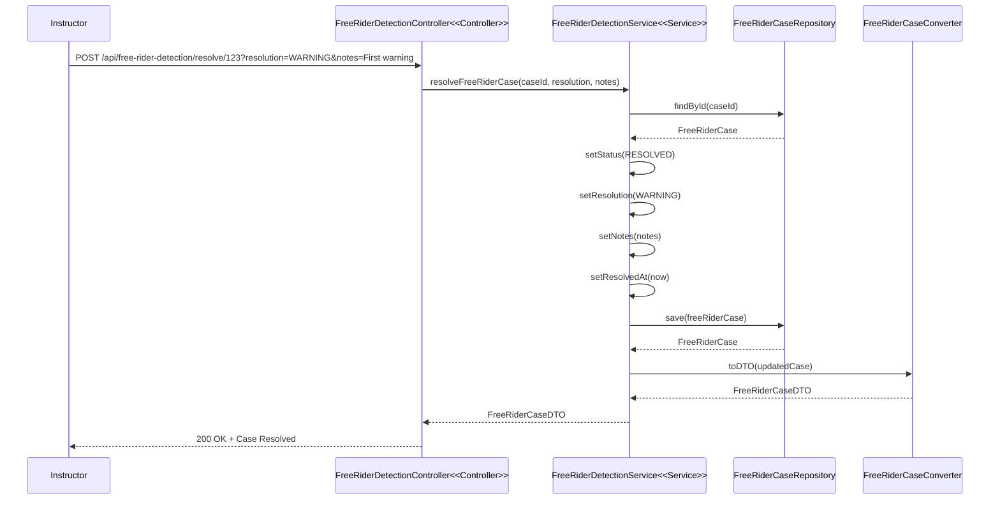

### Scenario 6: Get Risk Scores (Happy Path)

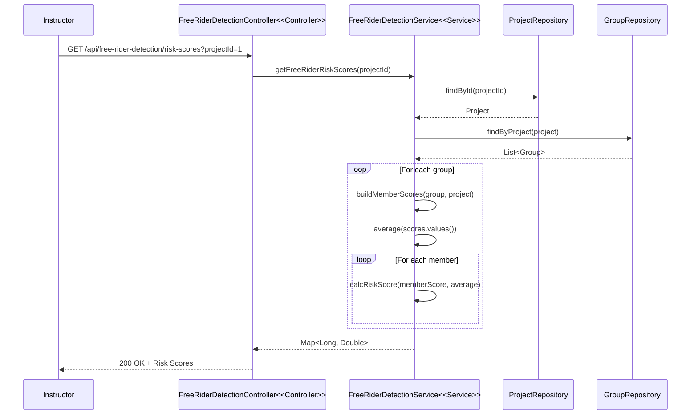

### Scenario 7: No Free-riders Detected (Alternative Flow)

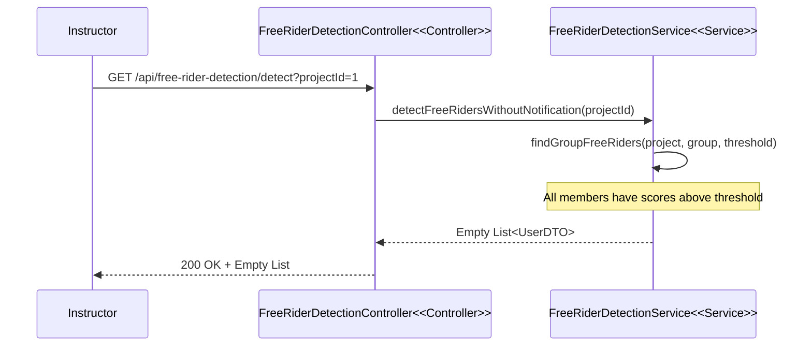

### Scenario 8: Case Already Exists (Exception Flow)

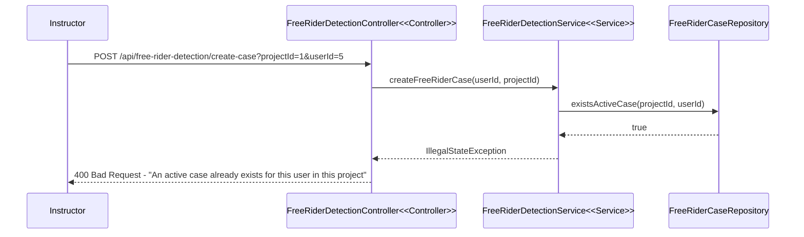

---

## Summary

**UC009 (Performance Chart Monitoring):**
- 5 scenarios covering happy paths and exception flows
- Each scenario ≤25 messages
- Proper separation of concerns with Controller and Service stereotypes
- Error handling with alt/else blocks

**UC010 (Free-rider Detection):**
- 8 scenarios covering manual detection, automated batch processing, case management
- Separate flows for notifications vs non-notifications
- Comprehensive error handling
- Batch/scheduler processes properly separated

All sequence diagrams follow the specified rules:
- ≤25 messages per scenario
- Happy path separated from alternate/exception flows
- Batch/scheduler processes separated
- Proper Mermaid syntax with stereotypes
- Error handling with alt/else blocks
